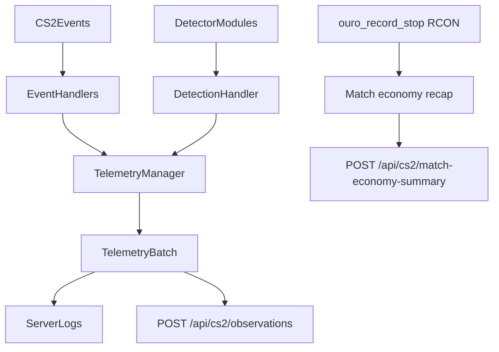

# Telemetry Architecture

## Purpose
This fork treats the plugin as an observation collector, not an automatic enforcement system. Server hooks and detector modules emit suspicious or high-signal gameplay data, the plugin aggregates that data in memory, and periodic batches are sent to an external API such as `ouro-edge`.

## Data Flow

## Ouro-controlled match session

Telemetry upload is **match-scoped**, not always-on:

- **`ouro_record_start <base64-json>`** (RCON) supplies authoritative `matchId`, server fields, map name, reporting interval, and both team rosters (`steamId64` + display name). The plugin opens a **recording session** and only aggregates signals while that session is active.
- **Live path**: filtered `TelemetryBatch` payloads (roster-matched humans only, SteamID64 from roster, bots excluded) are sent on the configured interval to **`POST /api/cs2/observations`** on `ouro-edge`.
- **`ouro_record_stop`** (RCON) ends the session, uploads a **single** per-match economy recap to **`POST /api/cs2/match-economy-summary`**, then clears session state. Live batches are not used for that final recap upload.

If no session is active, the plugin does not accumulate or upload telemetry.

Rollout caveat: this stricter live-route contract must ship with the match-scoped plugin session flow and the matching `gameCoordinator` changes. Legacy always-on batches with empty `MatchId`, Steam2 ids, or bot rows are expected to be rejected by `ouro-edge`.

## Main Runtime Pieces
- `Core/ACCore.cs`: plugin entrypoint and bootstrap order.
- `Handlers/EventHandlers.cs`: registers gameplay events and forwards them into telemetry.
- `Handlers/EventListeners.cs`: handles map lifecycle and periodic flush checks.
- `Detections/BaseModule.cs`: keeps detector modules as signal producers.
- `Core/DetectionHandler.cs`: converts detector findings into observation records instead of bans/kicks/webhooks.
- `Telemetry/TelemetryManager.cs`: in-memory aggregation, heuristic observation creation, periodic flush, and HTTP upload.
- `Telemetry/TelemetryConfig.cs`: runtime config and reload command for telemetry behavior.

## Match-signal tracker (`TelemetryMatchSignalTracker`)

Implementation: `Telemetry/TelemetryMatchSignalTracker.cs`, owned by `Telemetry/TelemetryManager.cs`.

The tracker is **not** a separate pipeline: it extends the same match-scoped live path as the rest of `TelemetryManager`. While `ShouldEmitLiveTelemetry()` is true, kills and round ends update this in-memory tracker; derived rows are converted with the same `ObservationRecord` shape and appended to `pendingObservations`, so they ride ordinary periodic `TelemetryBatch` uploads to `POST /api/cs2/observations`.

- **Kill bursts**: when a roster-matched human hits the short-window kill burst threshold, `RegisterBurst` runs. Opposing team size for enemy-share heuristics comes from the active `TelemetryMatchSession` (`Team1` / `Team2` counts via `GetOpposingRecordedRosterSize`), not from live in-game team sizes alone.
- **Round results**: `OnRoundEnd` forwards `winningTeam` into `RecordRoundResult`. Values `<= 1` are treated as unknown or non-CT/T and **do not** advance reconnect-phase accounting or emit reconnect spike observations.
- **Lifecycle**: the tracker instance is tied to telemetry reset semantics (see tests around `ResetState`): a new session or discard path can replace it so match-signal state does not leak across unrelated recordings.

Kinds emitted today include `combat_profile` observations such as `match_repeated_kill_bursts` and `reconnect_post_phase_spike`, with metadata carried on the standard observation fields.

## Telemetry Families
### Baseline match and player metrics
- connects, disconnects, rounds played
- shots, hits, bullet impacts
- damage dealt and taken
- kills, deaths, headshots
- flash, smoke, molotov, and utility-damage counters

### Suspicious combat context
- smoke kills
- wallbang kills
- blind kills and damage while blind
- noscope kills
- airborne kills
- multi-kill bursts in short windows

### Weapon profile metrics
- per-weapon shots, hits, kills, and damage
- pistol-heavy kill profiles over time
- short-window bursts with high-signal weapons such as the revolver and scout
- high kill concentration with revolver or scout relative to the player's total kill mix

### Utility profile metrics
- flashbang, smoke, and molotov usage
- utility damage dealt and taken
- utility-damage milestones that may be useful for later scoring
- zero-utility kill profiles for players who accumulate kills without any meaningful utility participation

### Economy telemetry
- explicit purchase rows from `EventItemPurchase`
- explicit snapshots from `round_freeze_end`, `enter_buyzone`, `exit_buyzone`, `buytime_ended`, and `round_end`
- money fields from `InGameMoneyServices` such as `Account`, `StartAccount`, `CashSpentThisRound`, and `TotalCashSpent`
- inventory snapshots from `WeaponServices.MyWeapons`
- sell/refund/rebuy inference deferred to `ouro-edge`; the plugin only emits the ledger rows and snapshots needed to derive those later

### Audio context
- player footstep counts
- player sound counts

## Batch identity fields
Each live `TelemetryBatch` carries fleet and match correlation:

- `ServerId`, `ServerLabel`, `ServerRegion`, `MatchSource`, `MapName`
- **`MatchId`** — required for ingestion on `ouro-edge` in the match-scoped model; set from the active session started by `ouro_record_start`

Config defaults in `Telemetry.json` apply only when no session is active; during recording, session metadata from Ouro overrides them for uploads.

## Silent Operation Contract
The plugin must remain invisible to normal players:
- no chat output
- no HUD or center text
- no player-facing console or user-message disclosures
- logs and API uploads only

## Intentional deferrals
- MatchZy-specific match identifiers and match-state joins (beyond the Ouro RCON session contract)
- higher-confidence positional or visibility modeling for wallhack scoring
- persistent retry queues for failed uploads
- first-class sell/refund/rebuy events unless CounterStrikeSharp exposes a reliable hook later
