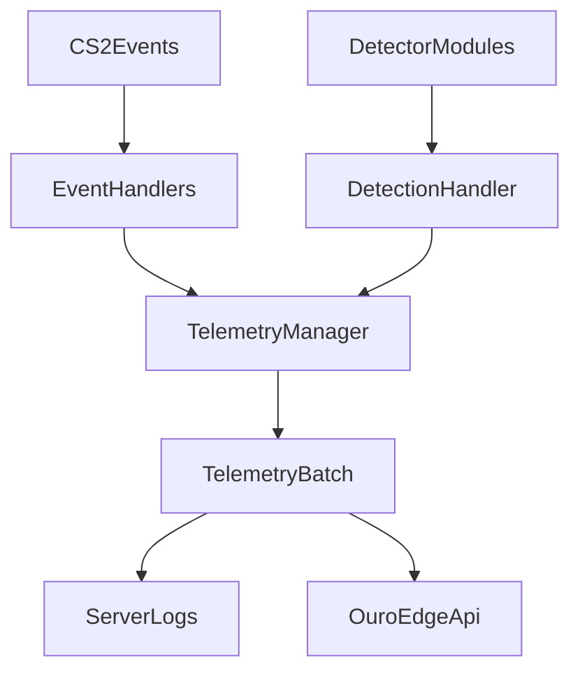

# Telemetry Architecture

## Purpose
This fork treats the plugin as an observation collector, not an automatic enforcement system. Server hooks and detector modules emit suspicious or high-signal gameplay data, the plugin aggregates that data in memory, and periodic batches are sent to an external API such as `ouro-edge`.

## Data Flow

## Main Runtime Pieces
- `Core/ACCore.cs`: plugin entrypoint and bootstrap order.
- `Handlers/EventHandlers.cs`: registers gameplay events and forwards them into telemetry.
- `Handlers/EventListeners.cs`: handles map lifecycle and periodic flush checks.
- `Detections/BaseModule.cs`: keeps detector modules as signal producers.
- `Core/DetectionHandler.cs`: converts detector findings into observation records instead of bans/kicks/webhooks.
- `Telemetry/TelemetryManager.cs`: in-memory aggregation, heuristic observation creation, periodic flush, and HTTP upload.
- `Telemetry/TelemetryConfig.cs`: runtime config and reload command for telemetry behavior.

## Telemetry Families
### Baseline match and player metrics
- connects, disconnects, rounds played
- shots, hits, bullet impacts
- damage dealt and taken
- kills, deaths, headshots
- flash, smoke, molotov, and utility-damage counters

### Suspicious combat context
- smoke kills
- wallbang kills
- blind kills and damage while blind
- noscope kills
- airborne kills
- multi-kill bursts in short windows

### Weapon profile metrics
- per-weapon shots, hits, kills, and damage
- pistol-heavy kill profiles over time
- short-window bursts with high-signal weapons such as the revolver and scout
- high kill concentration with revolver or scout relative to the player's total kill mix

### Utility profile metrics
- flashbang, smoke, and molotov usage
- utility damage dealt and taken
- utility-damage milestones that may be useful for later scoring
- zero-utility kill profiles for players who accumulate kills without any meaningful utility participation

### Economy telemetry
- explicit purchase rows from `EventItemPurchase`
- explicit snapshots from `round_freeze_end`, `enter_buyzone`, `exit_buyzone`, `buytime_ended`, and `round_end`
- money fields from `InGameMoneyServices` such as `Account`, `StartAccount`, `CashSpentThisRound`, and `TotalCashSpent`
- inventory snapshots from `WeaponServices.MyWeapons`
- sell/refund/rebuy inference deferred to `ouro-edge`; the plugin only emits the ledger rows and snapshots needed to derive those later

### Audio context
- player footstep counts
- player sound counts

## Batch Identity Fields
Each batch now has placeholders for fleet and match correlation:
- `ServerId`
- `ServerLabel`
- `ServerRegion`
- `MatchSource`
- `MatchId`

These are config-driven today and can later be populated from orchestration or MatchZy context.

## Silent Operation Contract
The plugin must remain invisible to normal players:
- no chat output
- no HUD or center text
- no player-facing console or user-message disclosures
- logs and API uploads only

## Intentional Deferrals
- MatchZy-specific match identifiers and match-state joins
- higher-confidence positional or visibility modeling for wallhack scoring
- persistent retry queues for failed uploads
- first-class sell/refund/rebuy events unless CounterStrikeSharp exposes a reliable hook later
